# Oii galera, prazer eu sou o Guilherme e sou um dev apaixonado por tecnologia e programação 🧑‍💻

Seja bem-vindo ao meu perfil! Aqui você encontrará projetos, ideias e muita paixão por desenvolvimento de software. Sempre buscando aprender, evoluir e compartilhar conhecimentos. 🚀

---

  

  

---

## 👾 Minha Stack

Estas são as tecnologias e ferramentas com as quais trabalho:

### 🌐 Frontend

  

  

  

  

  

  

  

  

### 🔙 Backend

  

  

  

  

  

  

  

  

  

### 🛠️ Ferramentas

  

  

  

  

  

  

  

  

### 💾 Bancos de Dados

  

  

  

  

  

---

## 🐍 Snake Game

  

---

## 🌐 Redes Sociais & Contato

  

  

  

---

## 📚 Sobre mim

- 🔭 Atualmente trabalho principalmente com **Backend**, utilizando **Java** e **Spring Boot**.
- ☁️ Estou explorando cada vez mais o mundo de **Cloud Computing** e **AWS**.
- 🌱 Atualmente estou aprofundando meus conhecimentos em **DevOps**, **CI/CD** e arquitetura de software.
- 🏗️ Tenho interesse em **arquiteturas escaláveis**, **Clean Architecture**, **DDD** e **SOLID**.
- 🧪 Valorizo **testes automatizados**, qualidade de código e boas práticas de desenvolvimento.
- 🎯 Meu objetivo é continuar evoluindo como desenvolvedor e contribuir para projetos relevantes.
- ⚡ Fato curioso: Amo resolver desafios de lógica e sou um entusiasta de **Inteligência Artificial**.

---

## 🚀 Tecnologias que estou estudando

  

---

### 💻 Sempre aprendendo, sempre evoluindo.

**Obrigado pela visita!** ⭐

Se você curtiu algum dos meus projetos, não esqueça de deixar uma estrela! 😄

